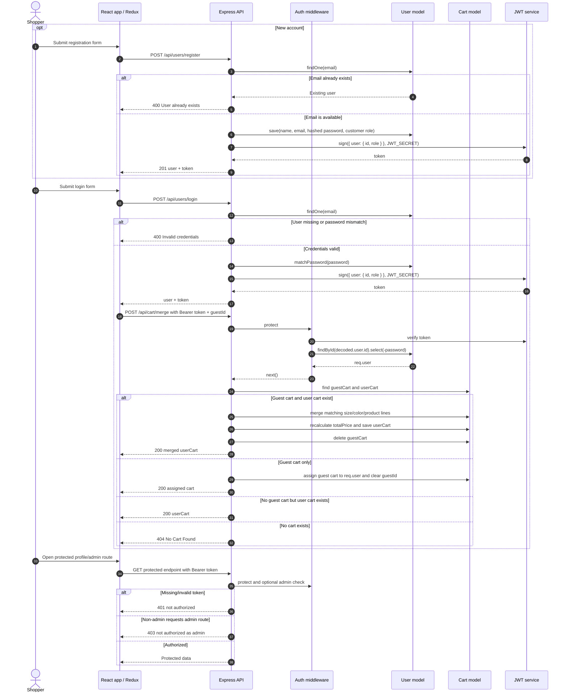
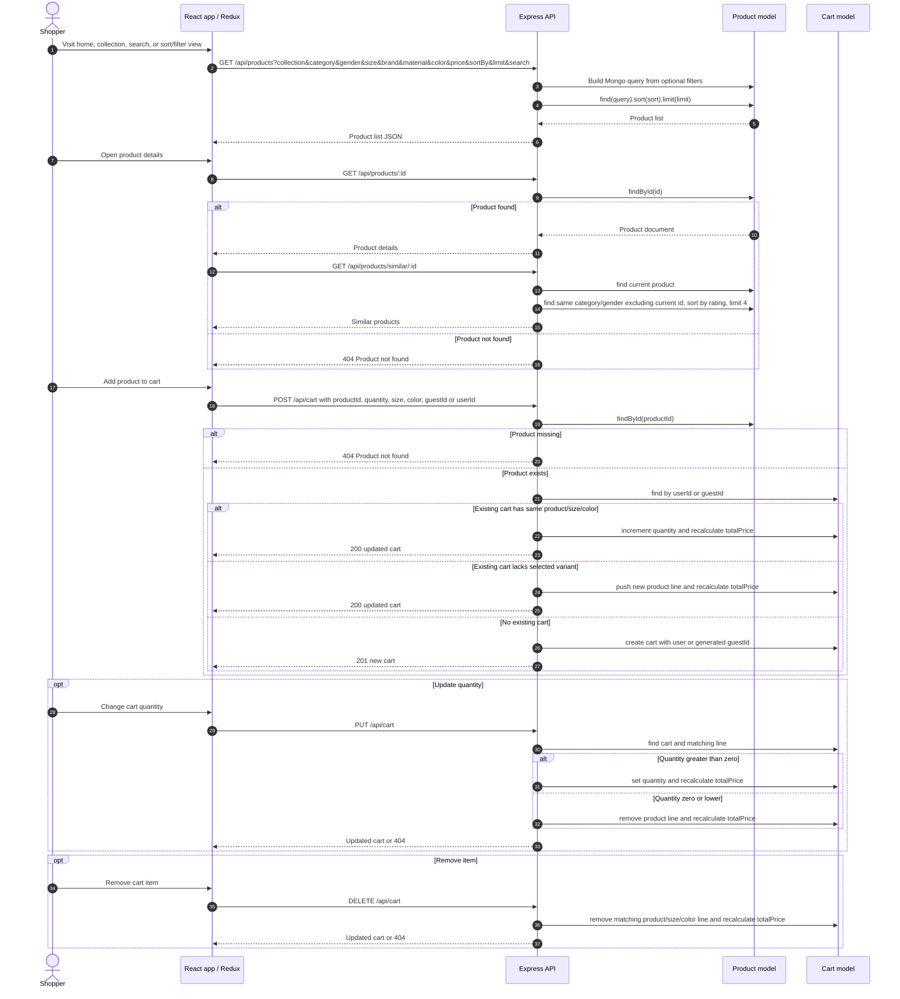
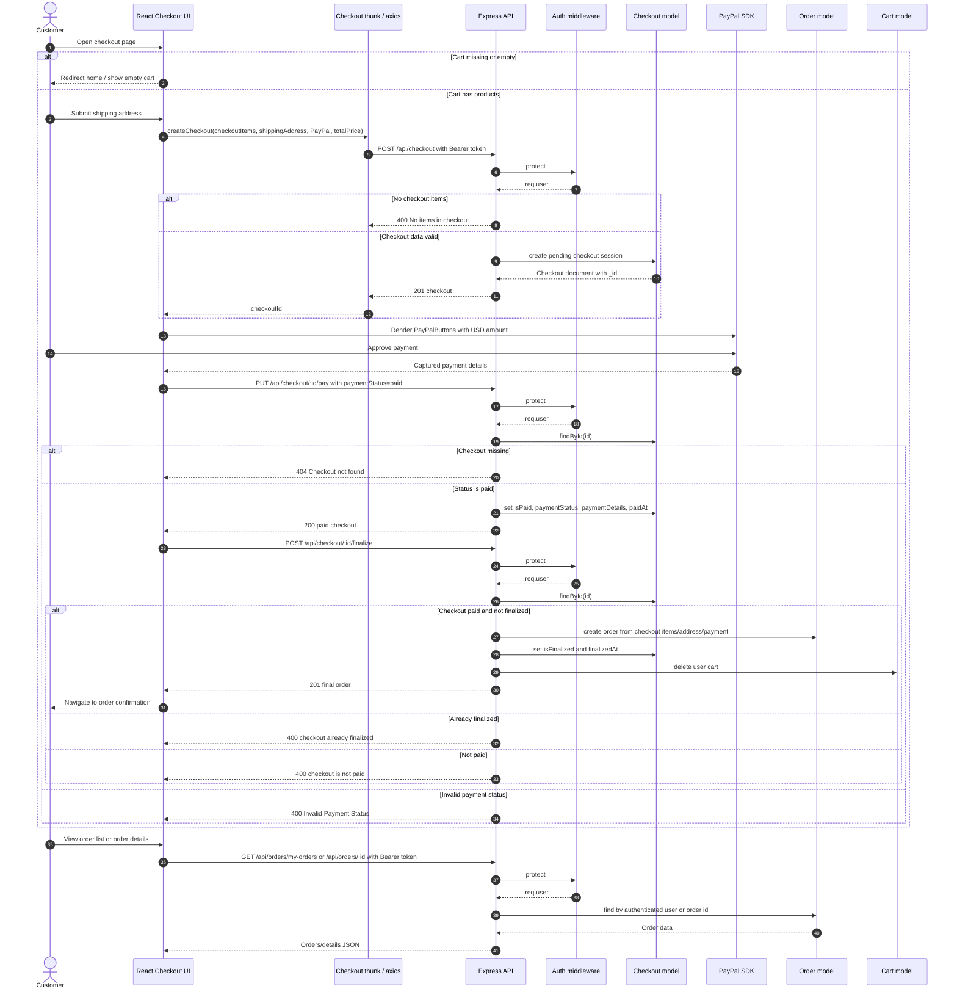
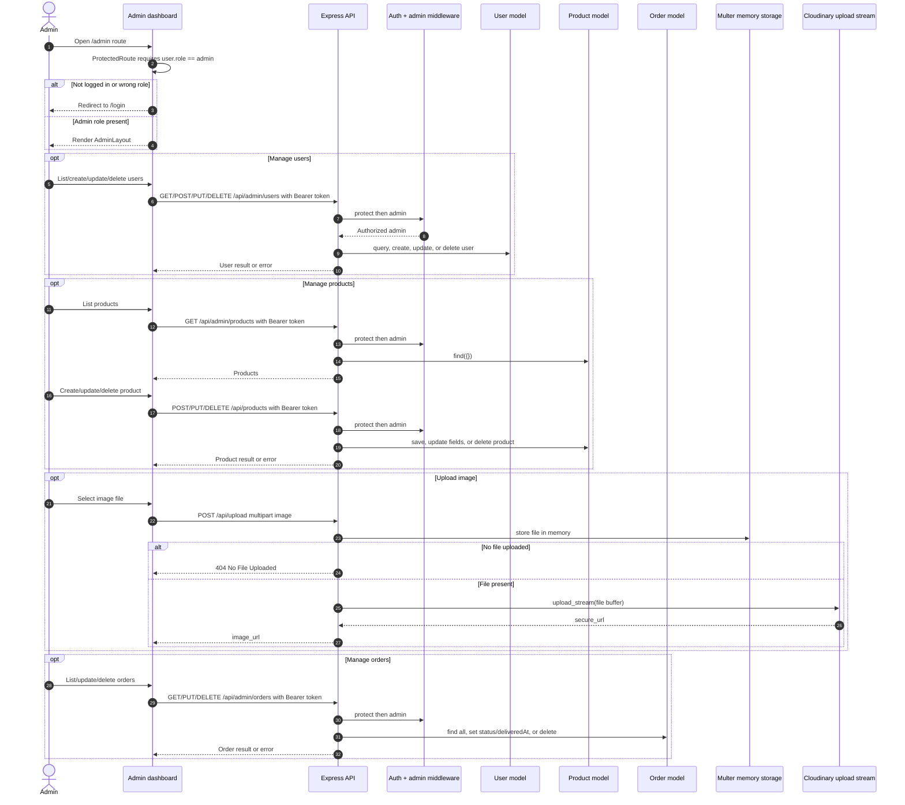
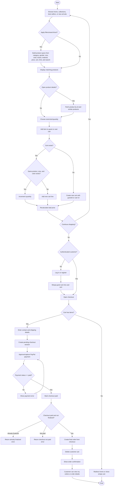
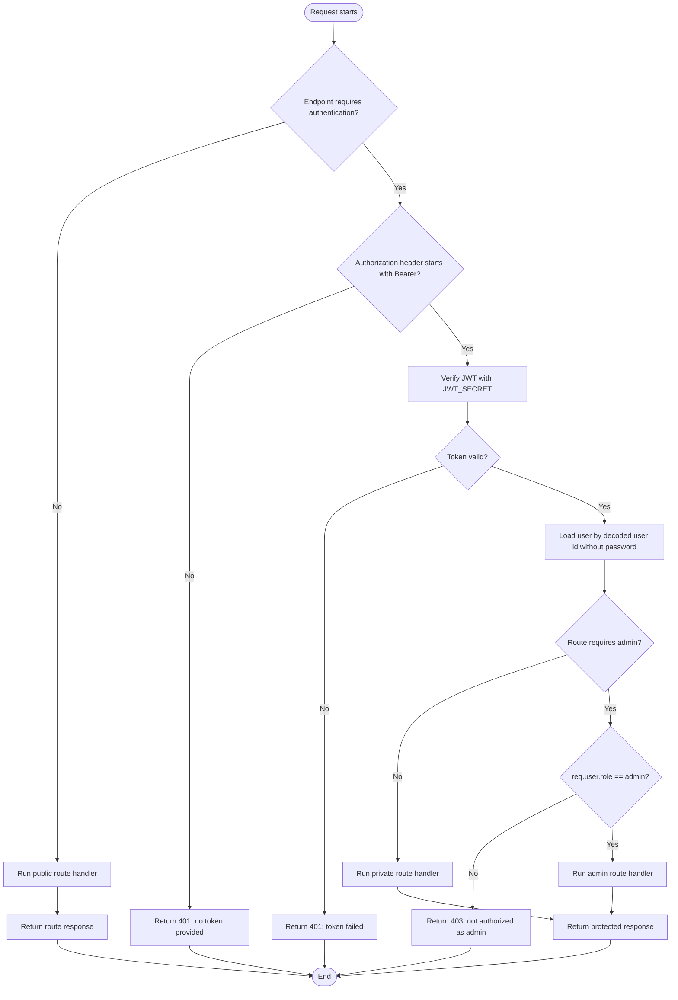
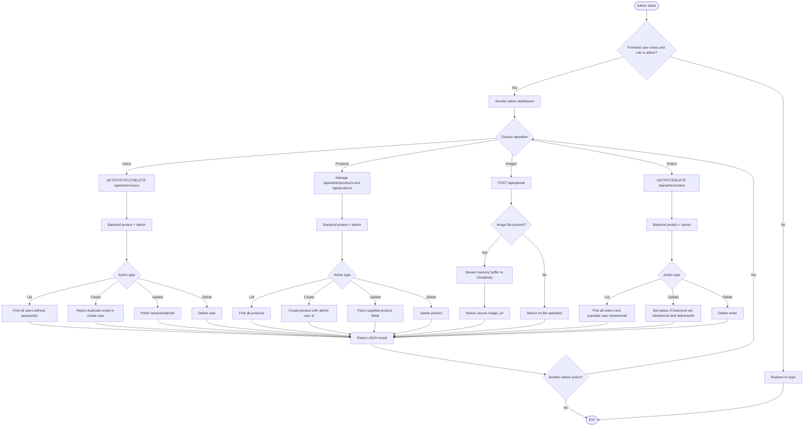

# Rabbit Behavioral Diagrams

This document summarizes Rabbit's runtime behavior after reviewing the frontend route map, Redux/API calls, Express routes, middleware, and persistence models. Diagrams are written in Mermaid so they can be rendered by GitHub, many Markdown previewers, and Mermaid Live Editor.

PlantUML equivalents are available as separate self-contained `.puml` files in `docs/plantuml/README.md` for teams that prefer PlantUML renderers or need one source file per diagram.

Rendered SVG visualizations are embedded in `docs/diagram-visualizations.md` for quick viewing without a separate diagram renderer.

## System Actors and Boundary

Rabbit has three primary external actors:

- **Guest shopper**: browses products, searches/filters, subscribes to the newsletter, and can maintain a guest cart.
- **Authenticated customer**: does everything a guest can do, plus merges a guest cart, checks out, pays with PayPal, and views orders.
- **Admin user**: manages users, products, images, and orders through protected admin routes.

Supporting external systems are **PayPal** for payment capture, **Cloudinary** for image uploads, and **MongoDB** for persistence.

---

## Use Case Diagram

```mermaid
flowchart LR
    Guest([Guest shopper])
    Customer([Authenticated customer])
    Admin([Admin user])
    PayPal([PayPal])
    Cloudinary([Cloudinary])
    MongoDB[(MongoDB)]

    subgraph Rabbit["Rabbit e-commerce platform"]
        UC_Browse((Browse catalog))
        UC_Search((Search/filter/sort products))
        UC_ViewProduct((View product details))
        UC_ViewSimilar((View similar products))
        UC_Subscribe((Subscribe to newsletter))
        UC_Register((Register account))
        UC_Login((Log in))
        UC_GuestCart((Manage guest cart))
        UC_UserCart((Manage customer cart))
        UC_MergeCart((Merge guest cart on login))
        UC_Checkout((Create checkout session))
        UC_Pay((Pay for checkout))
        UC_Finalize((Finalize order))
        UC_ViewOrders((View own orders))
        UC_ViewProfile((View profile))
        UC_AdminUsers((Manage users))
        UC_AdminProducts((Create/update/delete products))
        UC_AdminImages((Upload product images))
        UC_AdminOrders((Manage order fulfillment))
        UC_Protect((Authorize protected routes))
    end

    Guest --> UC_Browse
    Guest --> UC_Search
    Guest --> UC_ViewProduct
    Guest --> UC_ViewSimilar
    Guest --> UC_Subscribe
    Guest --> UC_Register
    Guest --> UC_Login
    Guest --> UC_GuestCart

    Customer --> UC_Browse
    Customer --> UC_Search
    Customer --> UC_ViewProduct
    Customer --> UC_UserCart
    Customer --> UC_MergeCart
    Customer --> UC_Checkout
    Customer --> UC_Pay
    Customer --> UC_Finalize
    Customer --> UC_ViewOrders
    Customer --> UC_ViewProfile

    Admin --> UC_Login
    Admin --> UC_AdminUsers
    Admin --> UC_AdminProducts
    Admin --> UC_AdminImages
    Admin --> UC_AdminOrders

    UC_UserCart -. includes .-> UC_Protect
    UC_MergeCart -. includes .-> UC_Protect
    UC_Checkout -. includes .-> UC_Protect
    UC_Pay -. includes .-> UC_Protect
    UC_Finalize -. includes .-> UC_Protect
    UC_ViewOrders -. includes .-> UC_Protect
    UC_ViewProfile -. includes .-> UC_Protect
    UC_AdminUsers -. includes .-> UC_Protect
    UC_AdminProducts -. includes .-> UC_Protect
    UC_AdminOrders -. includes .-> UC_Protect

    UC_Pay --> PayPal
    UC_AdminImages --> Cloudinary

    UC_Browse --> MongoDB
    UC_Search --> MongoDB
    UC_ViewProduct --> MongoDB
    UC_ViewSimilar --> MongoDB
    UC_Subscribe --> MongoDB
    UC_Register --> MongoDB
    UC_Login --> MongoDB
    UC_GuestCart --> MongoDB
    UC_UserCart --> MongoDB
    UC_MergeCart --> MongoDB
    UC_Checkout --> MongoDB
    UC_Finalize --> MongoDB
    UC_ViewOrders --> MongoDB
    UC_AdminUsers --> MongoDB
    UC_AdminProducts --> MongoDB
    UC_AdminOrders --> MongoDB
```

---

## Sequence Diagrams

### 1. Registration, Login, Protected Access, and Guest Cart Merge

### 2. Catalog Browsing, Product Details, and Cart Management

### 3. Checkout, PayPal Payment, Order Finalization, and Customer Order Views

### 4. Admin Management and Image Upload

---

## Activity Diagrams

### 1. Customer Shopping and Checkout Activity

### 2. Authentication and Authorization Activity

### 3. Admin Operations Activity

---

## Source-to-Diagram Traceability

| Diagram area | Primary code reviewed |
| --- | --- |
| Frontend route map and admin guard | `frontend/src/App.jsx`, `frontend/src/components/Common/ProtectedRoute.jsx` |
| Authentication and authorization | `backend/routes/userRoutes.js`, `backend/Middleware/AuthMiddleware.js`, `backend/models/User.js` |
| Catalog and product management | `backend/routes/productRoutes.js`, `backend/routes/productAdminRoutes.js`, `backend/models/Product.js` |
| Cart behavior and guest merge | `backend/routes/cartRoutes.js`, `backend/models/Cart.js` |
| Checkout, PayPal, and order finalization | `frontend/src/components/Cart/Checkout.jsx`, `frontend/src/components/Cart/PayPalButton.jsx`, `backend/routes/checkoutRoutes.js`, `backend/routes/orderRoutes.js` |
| Admin users/products/orders/uploads | `backend/routes/adminRoutes.js`, `backend/routes/productRoutes.js`, `backend/routes/productAdminRoutes.js`, `backend/routes/adminOrderRoutes.js`, `backend/routes/uploaderRoutes.js` |
| API mounting and system boundary | `backend/server.js` |
