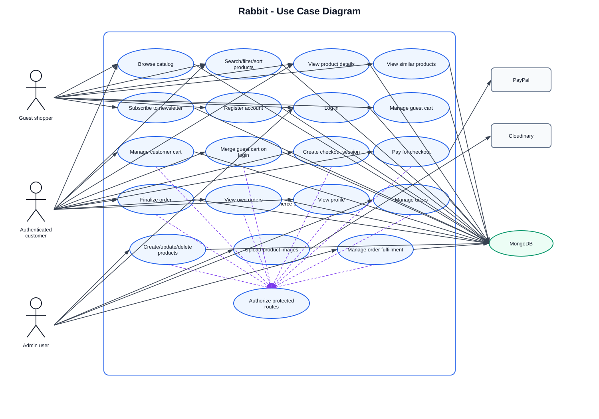
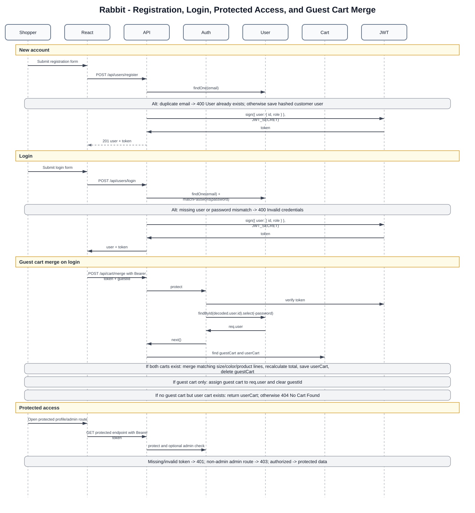
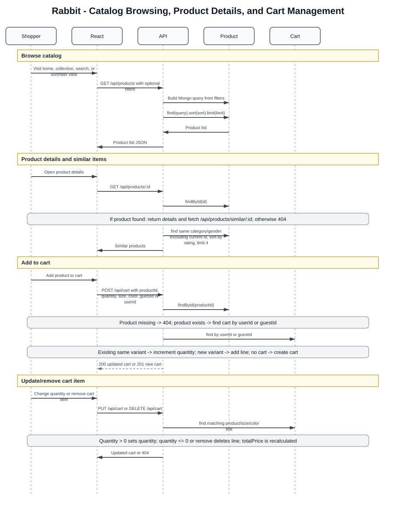
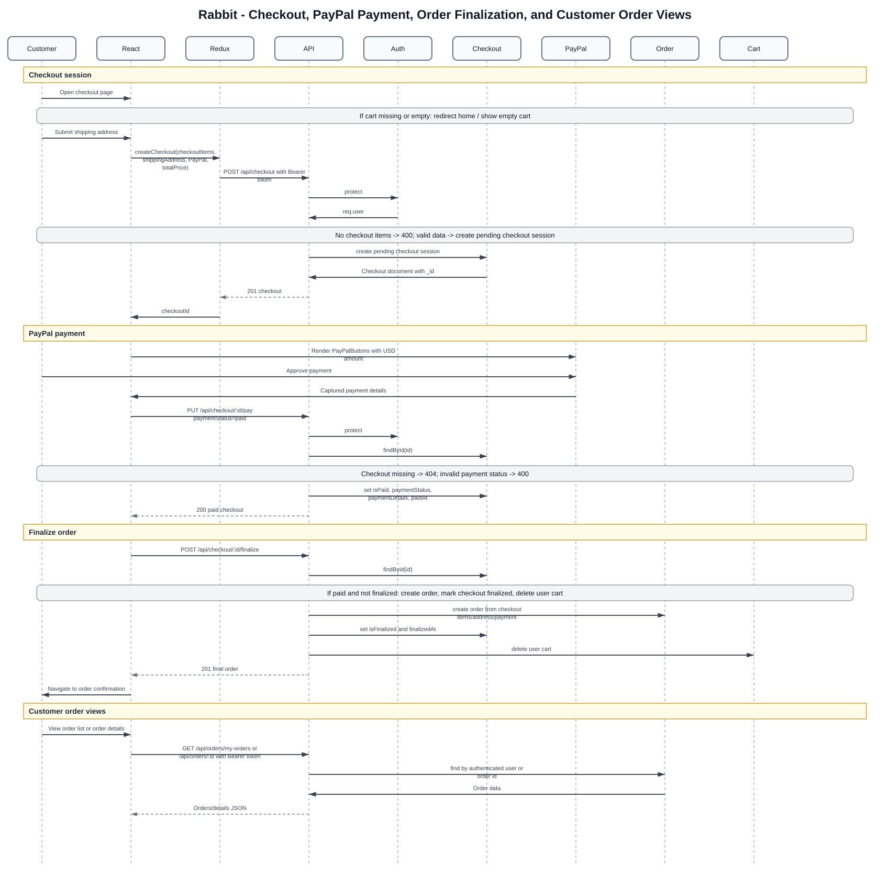
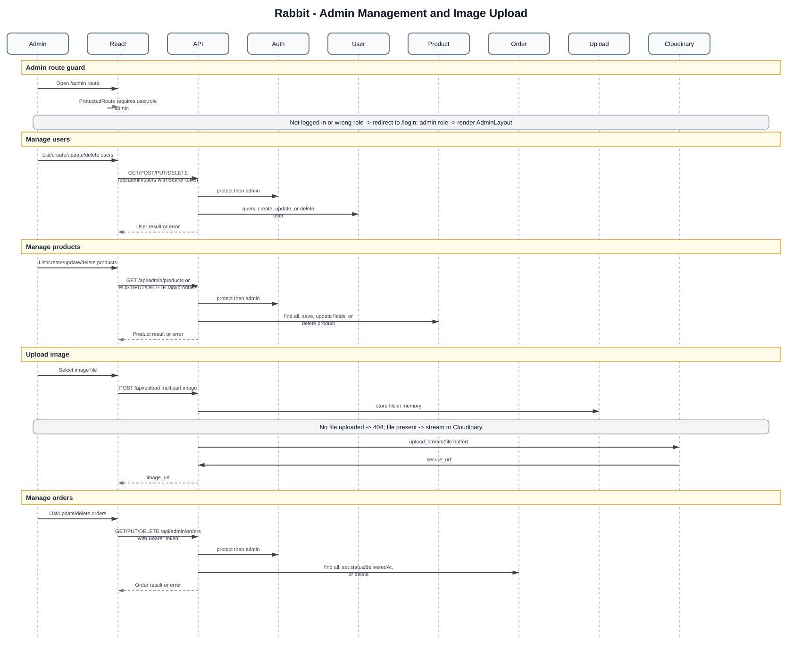
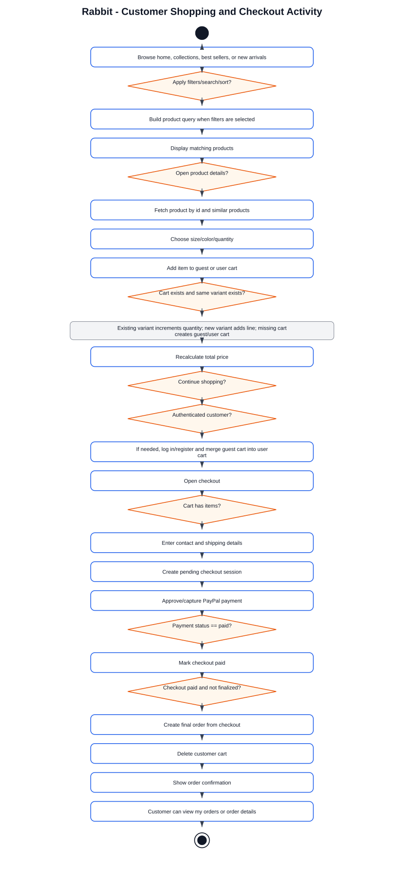
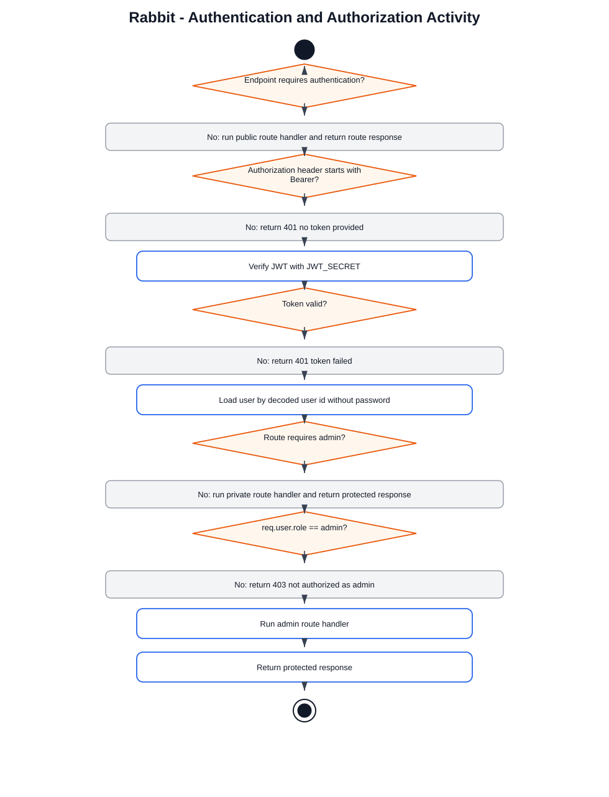
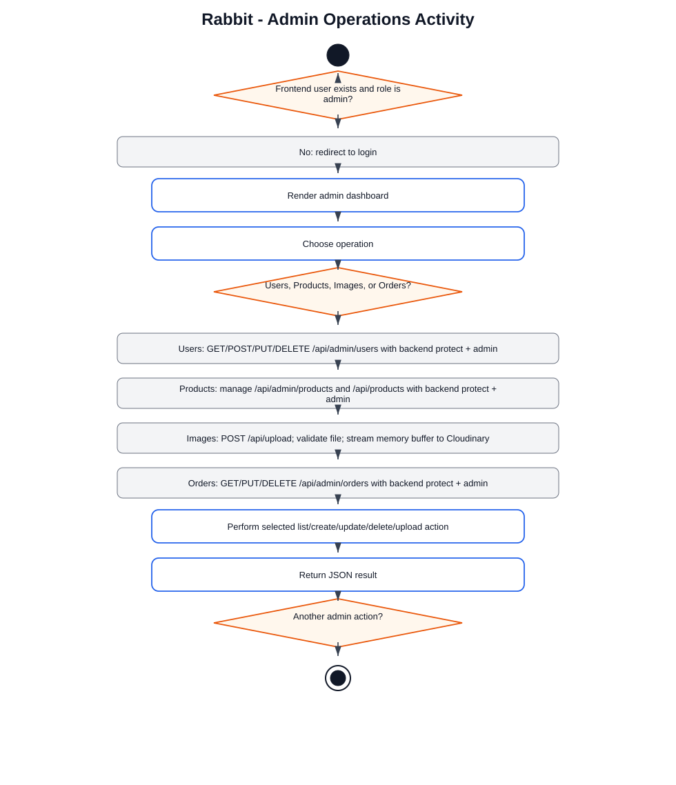

# Rabbit Diagram Visualizations

This page embeds the rendered SVG visualizations generated from the behavioral diagram set. Use this file when you want to inspect the diagrams directly in a Markdown viewer without copying Mermaid or PlantUML code into a separate renderer.

The source diagrams remain available in:

- Mermaid format: `docs/behavioral-diagrams.md`
- PlantUML format: `docs/plantuml/*.puml`

## 1. Use Case Diagram

## 2. Sequence Diagram: Registration, Login, Protected Access, and Guest Cart Merge

## 3. Sequence Diagram: Catalog Browsing, Product Details, and Cart Management

## 4. Sequence Diagram: Checkout, PayPal Payment, Order Finalization, and Customer Order Views

## 5. Sequence Diagram: Admin Management and Image Upload

## 6. Activity Diagram: Customer Shopping and Checkout

## 7. Activity Diagram: Authentication and Authorization

## 8. Activity Diagram: Admin Operations

